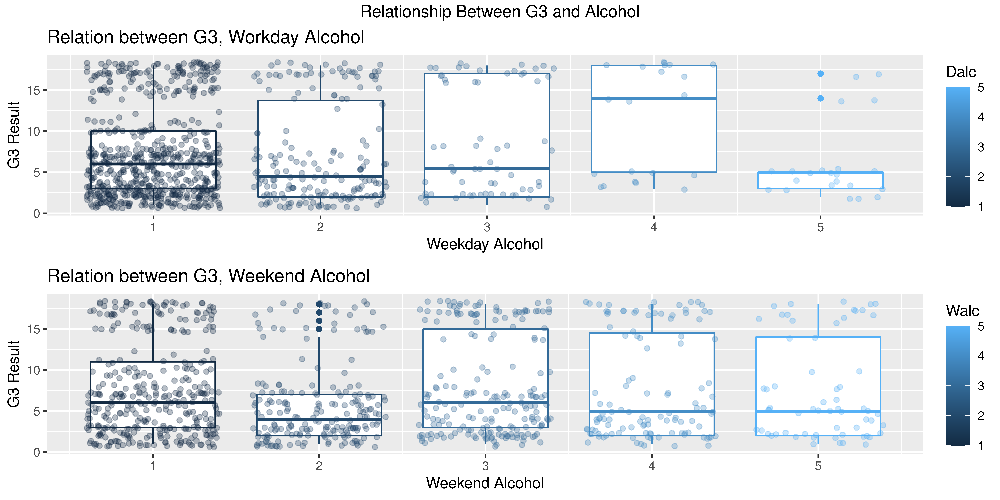

# Relation-Between-Result-and-Student-Attr

R STUDIO ASSIGNMENT

## FILE STRUCTURE
. 
├── img                     # Images files result generated from `main.r`  
├── attr.txt                # .txt file that store .csv columns attribute and meaning  
├── main.r                  # the only R file  
├── student.csv             # Example dataset  
└── README.md

## Documentation
https://cloudmails-my.sharepoint.com/:w:/g/personal/tp051098_mail_apu_edu_my/ERUWFDZC4itHlQdkRUmsFFwBfTXVxTiYeLxbbbcG9iAweg?e=YgInYE

## Result of the Assignment

